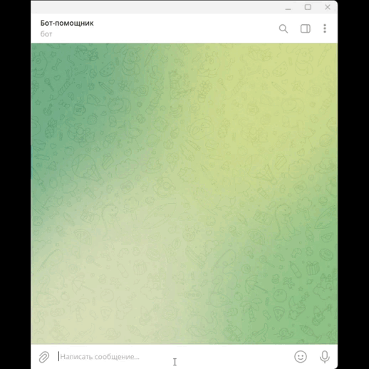

# Бот-помощник
Отвечает на типичные вопросы пользователей в чате Телеграм или ВКонтакте с помощью обученной нейросети.
## Основные системные требования:
* Ubuntu 20.04 LTS
* Python 3.9
* Зависимости из файла requirements.txt

## Запуск проекта
### Клонирование репозитория
Для клонирования репозитория необходимо установить git:
```shell
https://git-scm.com/downloads
```
Чтобы выполнить клонирование проекта из репозитория необходимо выполнить команду:
```shell
$ git clone https://github.com/sergeybv26/bot_helper.git
```
После копирования проекта из репозитория появится директория bot_helper

### Создание и активация виртуального окружения
```shell
$ cd bot_helper/
$ python3 -m venv env
$ source env/bin/activate
```
Пример строки-приглашения после выполнения команды:
```shell
(env) user@user-pc:~/bot_helper
```
### Установка зависимостей
```shell
$ pip3 install -r requirements.txt
```
Установка зависимостей должна завершиться сообщением: "Successfully installed ..."

### Получение чувствиетльных данных
Для работы приложения необходимо получить токен телеграм-бота помощника, токен телеграм-бота администратора и id чата администратора.
Кроме того, для реализации нейросети необходимо получить project_id и файл-json с параметрами google_application_credentials.

Для взаимодействия с API ВКонтакте необходимо получить ключ доступа:
* создать новое сообщество
* в сообществе перейти в Настройки/Работа с API
* создать ключ с правами управление сообществом и доступ к сообщениям сообщества

Для получения токена телеграм-бота необходимо:
* написать боту https://telegram.me/BotFather для создания нового телеграм-бота
* написать ```/start```, затем ```/newbot```
* ввести два имени: первое - как бот будет отбражаться в списке контактов, второе - имя, по которому его можно будет найти в поиске
* в ответном сообщении получаем токен нашего бота и сохраняем его

Для получения логов администратором рекомендуется создать отдельного бота.

Для получения id чата необходимо написать специальному боту https://telegram.me/userinfobot

Для получения project_id необходимо создать проект DialogFlow. Порядок создания проекта:https://cloud.google.com/dialogflow/es/docs/quick/setup
Затем необходимо создать агента DialogFlow. Порядок создания приведен здесь: https://cloud.google.com/dialogflow/es/docs/quick/build-agent
Для получения файла-json с параметрами google_application_credentials необходимо:
* установить gcloud CLI: https://cloud.google.com/sdk/docs/install
* выполнить авторизацию c использованием Google Cloud CLI: https://cloud.google.com/docs/authentication/provide-credentials-adc

### Создание файла с переменными окружения
Переменные окружения для настройки проекта:
* ```BOT_TOKEN``` - Токен телеграм-бота
* ```CHAT_ID``` - id чата
* ```ADM_BOT_TOKEN``` -Токен телеграм-бота для администратора
* ```GOOGLE_APPLICATION_CREDENTIALS``` - Путь к файлу application_default_credentials.json
* ```PROJECT_ID``` - id проекта DialogFlow
* ```VK_KEY``` - Ключ API ВКонтакте

Создать файл .env и записать в него параметры из файла .env.sample
```shell
$ touch .env
$ nano .env
```

### Запуск приложения
Перед запуском приложения необходимо в Телеграм найти созданного бота администратора и начать с ним чат.

Для обучения нейросети необходимо выполнить команду:
```shell
python3 learning.py
```
После успешного завершения обучения нейросети в консоли будет выведено сообщение: "Обучение нейросети окончено"

Для запуска бота Телеграмм необходимо в командной строке выполнить команду:
```shell
python3 tg_bot.py
```

Для запуска бота ВКонтакте необходимо в командной строке выполнить команду:
```shell
python3 bot.py
```

Ознакомиться с функционалом бота-помощника можно:
* Телеграм ```https://t.me/sukhanov_helper_bot```
* ВКонтакте ```https://vk.com/club217816463```


